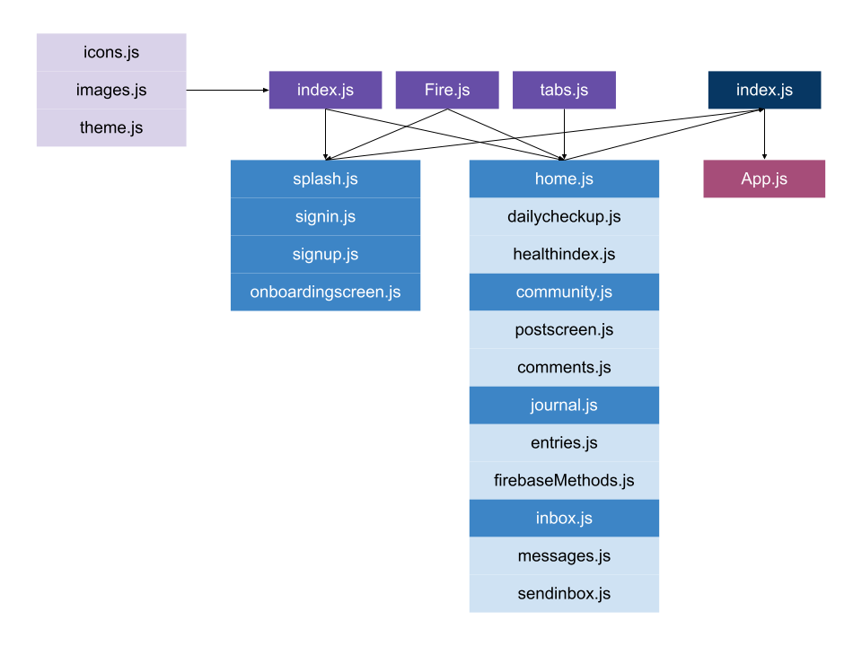

# deeper

> This ReadMe details code documentation (the software report or what should be called the README_SOFTWARE.md). 

---

## Table of Contents

- [Installation](#installation)
- [Development and Build Tools](#development-and-build-tools)
- [Software Modules](#software-modules)
- [Flow Chart](#flow-chart)

---

## Installation

1. Install [Visual Studio Code](https://code.visualstudio.com/) as an IDE to open and edit code. 
2. Clone the Github repository through source control on Visual Code Studio. 
3. Open a new terminal, go into the frontend directory, and run ``yarn install`` to install all the dependencies required for the project to run. 
4. Then, run ``expo start`` to open the app on a simulator of an Apple or Android device.

---

## Development and Build Tools

For our application, we are using React Native 0.64.3 for our frontend and Firebase ^9.6.8 for our backend. To see more details about our scripts and dependencies (as there are too many to list due to the scope of our software), please refer to ``package.json`` in the frontend folder. 

---

## Software Modules

For our app, the different modules are stored in the frontend folder (and most will be in the screens subfolder, which contains the different pages that users navigate from and to). The assets subfolder contains fonts for text, icons for interacting with, and images for visuals in the user interface. The table below explains the modules and where they are stored, listed from top to bottom and as ordered by the repository:

| Module | Overview |
| --- | --- |
| `firebaseMethods.js` | Located in the API subfolder, this is a POST API function that sends a journal entry and informs the user whether it has been successfully saved or not. |
| `icons.js` | Located in the constants folder, this exports the icons for use in the application. |
| `images.js` | Located in the constants folder, this exports the images for use in the application. |
| `index.js` | Located in the constants folder, this centralizes and exports all of the constants for use in the application. |
| `theme.js` | Located in the constants folder, this exports different colors, sizes, and fonts for use in the application. |
| `tabs.js` | Located in the navigation folder, this creates the navigation bar on the bottom of the screen that the user can see and use to move between pages and their different functionalities after signing in. |
| `comments.js` | Located in the screens folder, this allows the user to comment under a post in the community forum screen. |
| `community.js` | Located in the screens folder, this is in charge of the community forum page and contains a GET API to retrieve and show previous posts. |
| `dailycheckup.js` | Located in the screens folder, this allows the user to complete a survey regarding their mental health and reminds them to write a journal entry. |
| `entries.js` | Located in the screens folder, this allows the user to read their previous journal entries through a GET API. |
| `Fire.js` | Located in the screens folder, this is in charge of initializing and retrieving the Firebase app. |
| `healthindex.js` | Located in the screens folder, this allows the user to monitor their mental health through a graph. |
| `home.js` | Located in the screens folder, this is in charge of the home page that highlights the daily check-up, mental health index, mediation, and mental health resources (redirects to a list of links). |
| `inbox.js` | Located in the screens folder, this is in charge of the messaging system page that shows the different conversations that a user has and allows users to add new conversations. |
| `index.js` | Located in the screens folder, this centralizes and exports all of the screens for use in the application. |
| `journal.js` | Located in the screens folder, this is in charge of the journaling functionality that allows the user to write in a text field and save it through a POST API. |
| `messages.js` | Located in the screens folder, this is in charge of showing a user's favorite messages from the chat functionality. |
| `onboardingscreen.js` | Located in the screens folder, this allows the user to learn more about the app after signing in or signing up. |
| `postscreen.js` | Located in the screens folder, this allows the user to write and upload an image as a post for the community forum functionality. |
| `sendinbox.js` | Located in the screens folder, this renders the specific messages of a conversation between two users through a GET API and allows the user to send a message through a POST API. |
| `signin.js` | Located in the screens folder, this is in charge of the sign in functionality (requires the user's email and password) and connects to Firebase authentication. |
| `signup.js` | Located in the screens folder, this is in charge of the sign up functionality (where the user inputs their name, email, and password and connects to Firebase authentication. |
| `splash.js` | Located in the screens folder, this is the first page that the user is prompted to when opening the app and allows the user to sign in or sign up. |
| `App.js` | This contains the page navigation and first initializes the splash screen. |

---

## Flow Chart

---

[Back to the Top](#deeper)

